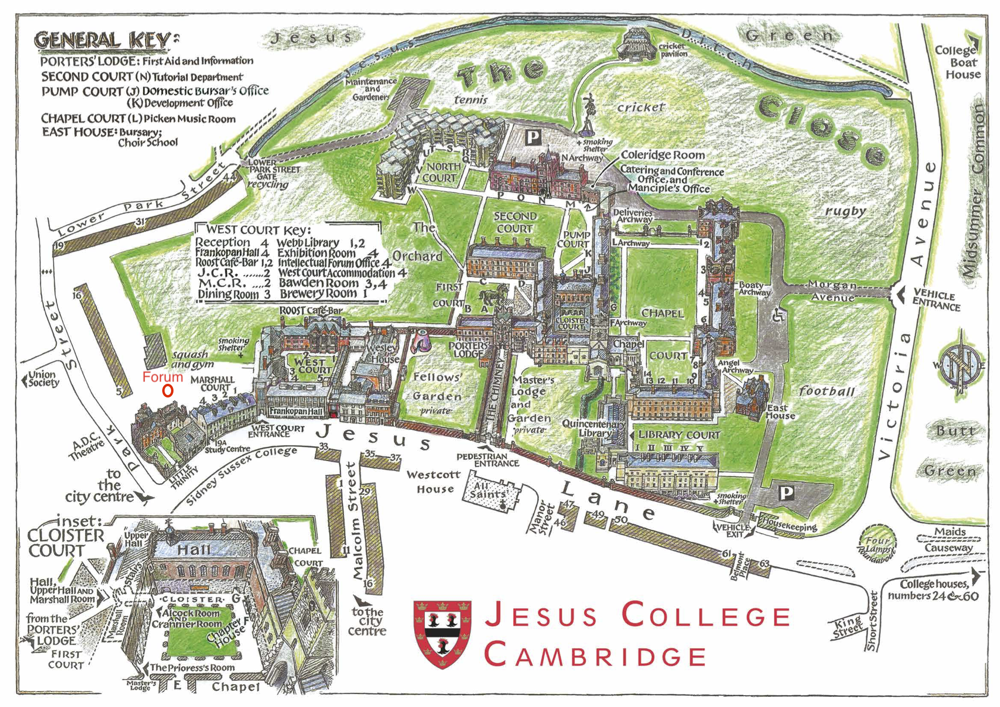



<b>Contents of this page:</b>
<ul id="contents">
</ul>

# Contacts during the School

* Marla Fuchs, [mf372@cam.ac.uk](mailto:mf372@cam.ac.uk)
* Dominic Orchard, [dao29@cam.ac.uk](mailto:dao29@cam.ac.uk) For emergencies, phone: +44 7835 776126
* Jacob Petersen, [jpetersen@schmidtfutures.com](mailto:jpetersen@schmidtfutures.com)

# Links for virtual participation

## Join Zoom Meeting

Meeting ID and passcode: sent via e-mail

__Sessions will also be recorded__

## Virtual social space

We have a virtual space for networking and socialising at [gather.town](https://app.gather.town/app/iH98CYXn5VYSMn9e/iccs-summerschool22)

Passcode: sent via e-mail

This can be a nice place for virtual antendees to chat and network during breaks.

# COVID-19 Policy

As the COVID pandemic is still underway, rest assured that our team is preparing COVID mitigation plans for the safety and comfort of our community. We will provide COVID testing (lateral flow tests) to all of our in-person attendees, and we strongly encourage masking when not eating or drinking. Masks will be provided with your welcome pack. We recommend that all participants have travel insurance in place in case healthcare services need to be accessed.  We also strongly encourage that each attendee be fully vaccinated with a booster against COVID-19 before attending in-person.

# Code of conduct

The open exchange of ideas and the freedom of thought and expression are central to the aims and goals of the summer school; these require an environment that recognizes the inherent worth of every person and group, that fosters dignity, understanding, and mutual respect, and that embraces diversity. We are dedicated to providing a safe, hospitable, productive, and harassment-free and discriminatioon-free environment for everyone attending, regardless of ethnicity, religion, disability, physical appearance, gender, or sexual orientation. In particular, we expect all the participants to use welcoming and inclusive language, to be respectful of differing viewpoints and experiences, to gracefully accept constructive criticism, to focus on what is best for the community, and to show empathy towards other community members. We expect everyone to communicate openly with respect and consideration for others, treating each other as equals. It is important to remember that a community where people feel uncomfortable or threatened is neither healthy nor productive.

There is no tolerance for unwelcome, hostile, or disruptive behaviour or speech that intimidates, creates discomfort, or interferes with a person’s participation or opportunity for participation at event.  Participants asked to stop any harassing behavior are expected to comply immediately. Participants violating these standards may be expelled from this and future events.

If you witness or are subject to unacceptable behavior, please talk to one of the ICCS
leadership: Dominic Orchard or Marla Fuchs. 

# Effect of Queen's state funeral on September 19th

As you'll know, we have had to re-organise the programme so that Monday 19th is a more informal "soft start" since the University is closed due to the state funeral for the late Queen. Furthermore, the day will be a public holiday with many shops and restaurants closed until the late afternoon. The [BBC has a helpful guide](https://www.bbc.co.uk/news/business-62879563).

Trains will be running although could be very full of people travelling to and from London to pay their respects. We recommend planning lots of time for your journey if you are travelling on Sunday or Monday.

# Travel to and from the summer school

## Air travel

The nearest airports to Cambridge are Stansted (30 miles) and Luton (40 miles). London Heathrow has the most routes from non-EU destinations. There's a direct train link to Cambridge from Stansted and Gatwick airports, and Heathrow airport is also easily accessible by train (via London King's Cross/London St Pancras) see below and coach (bus).

## Train

Cambridge is well connected by train and the main station is located about one mile from the city centre (around 20 minutes on foot). There is another train station, Cambridge North, around 2 miles north of the city. See National rail enquiries for train timetables and to book tickets. [thetrainline.com](http://thetrainline.com) is also a good resource for querying timings.

From London, the quickest route goes from London Kings Cross to Cambridge, taking roughly 50 minutes. A good route to take from the airport is the Heathrow Express to Paddington then the tube (metro) to Kings Cross / St. Pancras. A good website for planning train journeys is [Transport for London](https://tfl.gov.uk/plan-a-journey/). An alternate route which is longer but cheaper to get to London Kings Cross is to take the Piccadilly line all the way from Heathrow to Kings Cross St. Pancras.

There is a taxi rank outside the main Cambridge station and buses run frequently between the station and city centre (to/from Emmanuel Street/St Andrew's Street). The 'Universal' bus service route (see above) also picks up/sets down at Cambridge train station.

## Bus

In addition, [National Express coaches](https://www.nationalexpress.com/en) regularly run from Stansted, Luton, Heathrow and Gatwick airports to the city centre of Cambridge. National Express coaches usually stop on Parkside, next to Parker’s Piece in the city centre. 

Local bus services usually run to/from Cambridge bus station in Drummer Street, and/or the adjacent Emmanuel Street and St Andrew’s Street. There are frequent buses from the railway station to the city centre.
The 'U' / Universal bus service bus service runs from Eddington, next to the Madingley Road Park and Ride site, through to our Biomedical Campus from Monday to Saturday, and from Eddington to Cambridge Railway Station on Sundays.

## Car

If you’re planning on driving to Cambridge, we strongly recommend that you use the Park & Ride scheme. Parking in the city centre is extremely limited (with no parking at Jesus College) and several city centre roads have restricted access with penalties for using them.
Those travelling from the north can also use the Guided Busway Park & Ride services (follow signs for Longstanton P&R from Junction 29 of the A14).
Disabled parking is available in the city’s car parks and on some streets. Please check in advance with the Cambridge Tourist Information Centre or visit www.cambridge.gov.uk/parking.

# Accommodation

Jesus College, University of Cambridge, Jesus Ln, Cambridge CB5 8BL, UK [https://www.jesus.cam.ac.uk](https://www.jesus.cam.ac.uk)

En-suite private rooms are booked Monday September 19th to Friday, September 23. If you also requested Sunday September 18th or the night of Friday 23rd, then that will also be provided. As these accommodations will be assigned to you based on your travel dates and all charges for these dates will be covered by the organizers. 

__Please check in from 2pm. Unfortunately it is not possible to check in before 2pm.  Please check out by 10am.__

If you need to stay additional days, please contact us so that we can either help make arrangements for you, or suggest hotels nearby. Alternatively you can book rooms [at other Cambridge colleges](https://www.universityrooms.com/en-GB/city/cambridge/home/?gclid=Cj0KCQjwyOuYBhCGARIsAIdGQRPmV51U4HehYj7Oqag3AD4uNMV9HySBSz9eqwYYk0s3KKddsmvs3zsaAv_7EALw_wcB).

To check in, you need to visit the Porter's Lodge and give them your name. Tell them you are here for the ICCS Summer School. The Porter's lodge is located at the end of the ["chimney" accessible from the pedestrian entrance](https://www.google.com/maps/@52.2085531,0.1229193,19z) in this building:

__The accommodation includes breakfast on every day you are staying__, served between 07:30-09:00 each day in the [Main Hall of The Forum building](https://www.jesus.cam.ac.uk/articles/giving-old-building-new-lease-life) which is marked in red on the map below:

# Locations and travel during the week

[Maps of the colleges and buildings we will be using](https://www.google.com/maps/d/u/0/viewer?hl=en&ll=52.207831884944866%2C0.09996241467192579&z=15&mid=1kvpTd_oUmudZSElc-YKAlmvRWRSn_c8)

Cambridge is a small and busy city in the East of England, in the UK. The centre is best accessed and navigated on foot, though there are also buses (Google Maps is good at giving reliable information on them) and taxis. A good taxi company is Panther Taxis: +44 1223 715715. You may want to check out http://www.cam.ac.uk/cambarea/travel/taxis2.html  for some guidelines on taxi reservations and other safety measures.

## Locations

* The main location for the week will be the [MR2 meeting room](http://www.cms.cam.ac.uk/meeting-rooms) in the [Centre for Mathematical Sciences](https://www.google.com/maps/place/Centre+for+Mathematical+Sciences,+University+of+Cambridge/@52.2105205,0.1010316,17z/data=!3m1!4b1!4m5!3m4!1s0x47d870b5d14721b7:0x8efe4f9a0c4a3a23!8m2!3d52.2105205!4d0.1010316?hl=en). There will be signs posted at the entrance to the CMS.

* The Friday hackathon is at [William Gates Building](https://www.google.com/maps/place/William+Gates+Building,+15+JJ+Thomson+Ave,+Cambridge+CB3+0FD/@52.2081295,0.0929005,16z/data=!4m5!3m4!1s0x47d8774a3fdc414b:0xe98fb897497ce850!8m2!3d52.2109006!4d0.0916506?hl=en) aka the Computer Lab / Department of Computer Science and Technology.

* Accommodation is at [Jesus College](https://www.google.com/maps/place/Jesus+College,+University+of+Cambridge/@52.2094785,0.1216369,17z/data=!3m1!4b1!4m5!3m4!1s0x47d870945425bf3d:0xc933fa658bb0d129!8m2!3d52.2094752!4d0.1238309?hl=en). The central information point is the __Porter's lodge__ which can be access from the Jesus Lane by walking down the walkway and going to the first door on the left once entering through the college gates.

## Monday

Due to the state funeral for the Queen which is happening on this day, we have had to re-organise and merge Monday’s scientific programme into the rest of the week. Instead, we will have a low-key, informal start at Jesus College with lunch from 12:00 in the [Dining room of West Court](https://www.jesus.cam.ac.uk/sites/default/files/dining_room_floor_plan.pdf) and then a space to be in the [Webb library](https://www.jesus.cam.ac.uk/webb-library) during the day for informal networking:

## Tuesday-Thursday

To get from Jesus College to the CMS each day, Dominic will lead a group to walk from the college at 08:15, which will be a pleasant walk through the middle of the city, old colleges, over the bridge, up past the library, and on to the CMS.

There will be also be a mini-bus taxi available leaving from college at 08:30. 

Alternatively, it is easy to catch the [bus from the end of the road](https://www.google.com/maps/dir/Jesus+College,+University+of+Cambridge,+Jesus+Ln,+Cambridge+CB5+8BL/Centre+for+Mathematical+Sciences,+University+of+Cambridge,+Wilberforce+Rd,+Cambridge+CB3+0WA/@52.2083235,0.1078156,15z/data=!4m18!4m17!1m5!1m1!1s0x47d870945425bf3d:0xc933fa658bb0d129!2m2!1d0.1238309!2d52.2094752!1m5!1m1!1s0x47d870b5d14721b7:0x8efe4f9a0c4a3a23!2m2!1d0.1010316!2d52.2105205!2m3!6e0!7e2!8j1662539400!3e3) which runs regularly and provides a close connection between Jesus College and CMS (journey time, including walking roughly 10 minutes).

## Tuesday evening dinner

Tuesday evening we will be at Madingley Hall which is just outside the city. Transport will be provided, leaving the CMS at 17:45.

## Wednesday punting

We will go on a punting tour (boat tour) from 4:30-5:30pm on Wednesday. The punts will leave from [Scudamore's at the Quayside](https://www.google.com/maps/place/Scudamore's+Quayside+Punting+Station/@52.2097995,0.1166697,17z/data=!3m1!4b1!4m5!3m4!1s0x47d870a34a1b9acd:0xf9c5d731f202f46a!8m2!3d52.2097995!4d0.1166697?hl=en) which is close to Jesus College (just behind, also near Six). People will be walking over from the CMS at around 3:30pm. We recommend wearing warmer clothes. There should be time to go back to your room first if you want to leave luggage and change.

## Wednesday evening dinner

Wednesday evening we will be at Sidney Sussex College which is just round the corner from Jesus College, less than 5 minutes on foot.

## Friday

Friday's hackathon will be hosted in the Intel Laboratory at the [William Gates Building](https://www.google.com/maps/place/William+Gates+Building,+15+JJ+Thomson+Ave,+Cambridge+CB3+0FD/@52.2081295,0.0929005,16z/data=!4m5!3m4!1s0x47d8774a3fdc414b:0xe98fb897497ce850!8m2!3d52.2109006!4d0.0916506?hl=en)  (the Department of Computer Science and Technology, also known as the Computer Laboratory). Dominic will lead a crowd to get the bus from Jesus, leaving the porter's lodge at 08:15.

# Miscellaneous

* Dress code: the dinners do not have a particular dress code. We recommend standard smart-casual business/academic attire.
* Lunches and coffee breaks will be vegetarian and vegan.
* All provided dietary requirements are taken into account for the meals and dinners.

