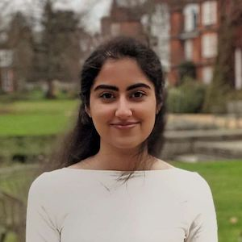
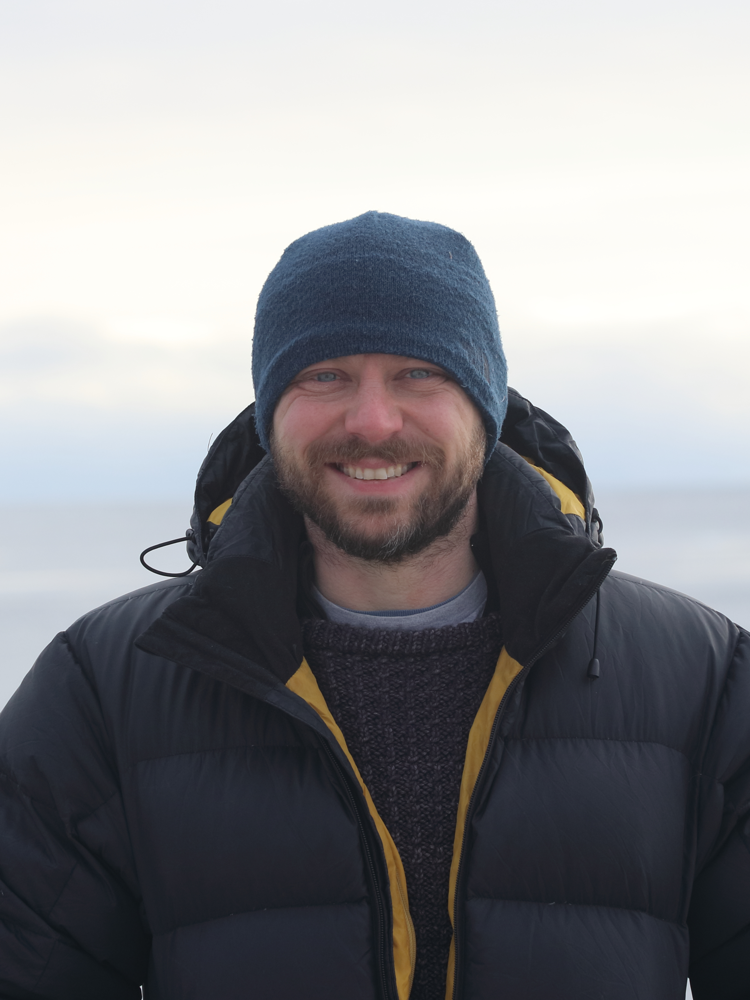
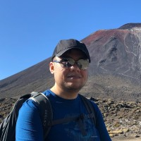
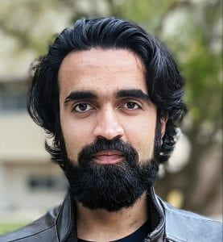



<b>Contents of this page:</b>
<ul id="contents">
</ul>

# In-person participants 

<table>
<tr><td>Aaron Wienkers</td><td> PhD Student, DAMTP </td></tr>  <tr><td>  </td><td> Aaron Wienkers is a PhD Student in the Department of Applied Mathematics & Theoretical Physics (DAMTP) at the University of Cambridge — Trinity College. Before coming to Cambridge, he was a Graduate Research Fellow in Flow Physics & Computational Engineering at Stanford University. His work develops the theoretical underpinnings for complex dynamical processes in geophysical and astrophysical fluid dynamics aided by numerical modelling.   </td></tr>
<tr><td>Alexander Smith</td><td> Software Engineer, The MathWorks (ICCS Guest) </td></tr>  <tr><td>  </td><td> (Candidate) Research Software Engineer ICCS, Software Engineer at The MathWorks, PhD in Computational Physics studying organic solar cell structure and charge transport.   </td></tr>
<tr><td>Anna Lo Piccolo</td><td> Graduate Student, Brown University </td></tr>  <tr><td>  </td><td> Anna is a graduate student at Brown University supervised by Chris Hovart and Baylor Fox-Kemper. She has a Masters from the University of Bologna, Italy, supervised by Nadia Pinardi. At Brown she has been working together with Baylor and Chris on sea ice-ocean interactions at ice edges and leads and their parameterization.   </td></tr>
<tr><td>Athena Elafrou</td><td> HPC Consultant, University Information Services, University of Cambridge </td></tr>  <tr><td>  </td><td> Athena Elafrou is an HPC Consultant at the Research Computing Services (RCS) of the University of Cambridge. Her expertise lies in the area of high-performance computing and her research interests revolve around parallel computer architecture, algorithm design and programming models with the aim to efficiently map applications on current and future heterogeneous computing systems.   </td></tr>
<tr><td>Aurélie Albert</td><td> Research Engineer, CNRS/IGE </td></tr>  <tr><td>  </td><td> Aurélie Albert, PhD, is currently in charge of the distribution of high-resolution simulations of the ocean, fine scales analysis and big data management and solutions. She has a background in Environmental Sciences from Ecole Nationale Supérieure des Techniques Avancées. She graduated in 2011 with a PhD in physical and biogeochemical oceanography from Université Pierre et Marie Curie, Paris VI.Aurélie Albert is a research engineer in the oceanography research team (MEOM) of the Institute of Geosciences and Environment (IGE) in Grenoble. This team promotes an integrated data-driven approach to computational oceanography that combines ocean modeling, geophysical fluid dynamics and satellite/in-situ observations. Aurélie is a specialist in high resolution modeling of ocean and sea-ice and develops methods and workflows suited to ‘big’ scientific data that come with the production and analysis of frontier simulations.
   </td></tr>
<tr><td>Ben Orchard</td><td> Research Assistant, University of Kent </td></tr>  <tr><td>  </td><td> Language fanatic (Haskell & Japanese) working on modern Fortran toolsHaskell fanatic working on modern Fortran static analysis tooling CamFort and staggered grids Python package xGCM, interested in compilers and Japanese   </td></tr>
<tr><td>Cecilia Bitz</td><td> Professor, University of Washington </td></tr>  <tr><td>  </td><td> Dr. Cecilia Bitz is a Professor of the Atmospheric Sciences Department and faculty in the Program on Climate Change, both at the University of Washington. Dr. Bitz has a research focus on polar climate change. She is an expert on climate prediction and works with models and observations of the earth system. She uses a variety of models for her research, from simple reduced models to sophisticated earth-system models. Cecilia’s group has recently written papers about Arctic sea ice predictability, extreme sea ice loss at both poles, sea ice data assimilation, and polar amplification. She has testified before the U.S. Senate Energy and Natural Resources Committee on Arctic climate change, and she was a Fulbright Senior Scholar to New Zealand, during which time she did fieldwork in Antarctica.Dr. Cecilia Bitz is a Professor of the Atmospheric Sciences Department and faculty in the Program on Climate Change, both at the University of Washington. Dr. Bitz has a research focus on polar climate change. She is an expert on climate prediction and works with models and observations of the earth system. She uses a variety of models for her research, from simple reduced models to sophisticated earth-system models. Cecilia’s group has recently written papers about Arctic sea ice predictability, extreme sea ice loss at both poles, sea ice data assimilation, and polar amplification. She has testified before the U.S. Senate Energy and Natural Resources Committee on Arctic climate change, and she was a Fulbright Senior Scholar to New Zealand, during which time she did fieldwork in Antarctica.   </td></tr>
<tr><td>Charlotte Durand</td><td> PhD, CEREA Ecole des Ponts </td></tr>  <tr><td>  </td><td> Charlotte Durand is a second year engineering PhD student at École des Ponts studying Deep Learning, Data assimilation, and sea-ice dynamicsCharlotte Durand is a second year engineering PhD student at École des Ponts studying Deep Learning, Data assimilation, and sea-ice dynamics   </td></tr>
<tr><td>Christopher Edsall</td><td> Head of Research Software Engineering, University of Cambridge </td></tr>  <tr><td>  </td><td> Christopher Edsall is a co-director of the Institute of Computing for Climate Science. He is also the Head of Research Software Engineering at RCS. He leads the team of research software engineers and HPC consultants with the goal of better software enabling better research. Christopher studied physics at the University of Canterbury and then worked in several research institutions in New Zealand (NIWA) and the UK (National Oceanography Centre and the University of Bristol) administering thier HPC systems and upskilling researchers in software engineering to make best use of the supercomputing facilities.    </td></tr>
<tr><td>Christopher Horvat</td><td> Senior Lecturer, Auckland University </td></tr>  <tr><td>  </td><td> Chris Horvat is a Senior Lecturer in Physics at the University of Auckland, and a Visiting Assistant Professor at Brown University. Between the two, he leads an exciting and nearly-antipodal group of polar oceanographers. Dr. Horvat studies connections between Earth's climate, oceans, sea ice, and life across physical scales.   </td></tr>
<tr><td>Colm-cille Caulfield</td><td> Professor Department of Applied Mathematics and Theoretical Physics, University of Cambridge </td></tr>  <tr><td>  </td><td> Colm-cille P. Caulfield is Professor of Environmental and Industrial Fluid Dynamics and Head of the Department of Applied Mathematics and Theoretical Physics (DAMTP), University of Cambridge. He is co-director of the Institute of 
Computing for Climate Science.
He is a Professorial Fellow of Mathematics in Churchill College, and an Adjunct Professor of Mechanics at Zhejiang University in Hangzhou, China. In 2014, he was elected as a Fellow of the American Physical Society, Division of Fluid Dynamics, and is Editor of the Journal of Fluid Mechanics, published by Cambridge University Press.
His research focuses on (trying to) understand turbulence and mixing in environmentally and industrially relevant flows, particularly where buoyancy forces play a key dynamical role. Important examples include heat transport in the world’s oceans, the dynamics of volcanic plumes, and the design of building interiors to minimise energy use while maintaining comfort and safety. More recently, he has become interested in addressing research problems relevant to the modelling of our rapidly changing climate using a twin-pronged approach of physics-informed and data-driven methods in combination.   </td></tr>
<tr><td>Dang Toai Phan</td><td> PhD student, Laboratoire Jacques-Louis Lions </td></tr>  <tr><td>  </td><td>    </td></tr>
<tr><td>Daniel Lee</td><td> Program Scientist, Schmidt Futures </td></tr>  <tr><td>  </td><td> Daniel A. Lee is a Program Scientist at Schmidt Futures. In this role, he shares broad responsibility for leading, developing, and managing innovative research programs, technologies, and people to address pressing issues and advance cutting-edge science.

Dan is an interdisciplinary scientist with 20 years of experience investigating the biological mechanisms underlying physiology, behavior, and neurodevelopment. He has a record of leading high-impact research with publications in the journals Nature Neuroscience, Neuron, Advanced Materials, eLife, Science Advances, and the Proceedings of the National Academies of Science. His research has been recognized through several awards including the NIH K99/R00 Pathway to Independence Award, NARSAD Young Investigator Award, and the Sleep Research Society Outstanding Early Investigator Award. Prior to Schmidt Futures, he was a Senior Research Associate at the California Institute of Technology, co-founded and led several not-for-profit groups, and served as a Board Member for the Wiseburn Education Foundation, and the Diversity Leadership Council at the Johns Hopkins University.

Dan holds a B.A. in Molecular and Cell Biology from the University of California, Berkeley, a Ph.D. in Neuroscience from the Johns Hopkins School of Medicine and completed his postdoctoral fellowship in Behavioral Genetics at the California Institute of Technology.   </td></tr>
<tr><td>Daoping Wang</td><td> Dr., University of Cambridge </td></tr>  <tr><td>  </td><td> Daoping Wang is a research fellow at the Department of Computer Science and Technology, University of Cambridge. Before joining Cambridge, Daoping received his PhD in Economics from the Shanghai University of Finance and Economics in 2022. His main fields of scientific interest include the economics of disasters and risk management; the complex interactions of climate change, global economic networks, and sustainable development; climate change and human behavior. His current research focuses on modeling the propagation of negative shocks on global supply-chain networks.    </td></tr>
<tr><td>Dominic Orchard</td><td> Co-director of ICCS, University of Cambridge </td></tr>  <tr><td>  </td><td> Dominic is the computer science Co-director of ICCS and an academic in the Department of Computer Science and Technology at the University of Cambridge, as well as an academic at School of Computing, University of Kent.   </td></tr>
<tr><td>Ellen Buckley</td><td> Postdoc, Brown University </td></tr>  <tr><td>  </td><td> Ellen is a PhD candidate in Atmospheric and Oceanic Science at the University of Maryland. Ellen is studying remote sensing of Arctic sea ice and is particularly interested in summer melt.   </td></tr>
<tr><td>Emily Shuckburgh</td><td> Director, ICCS, University of Cambridge </td></tr>  <tr><td>  </td><td> Professor Emily Shuckburgh OBE is Professor in Environmental Data Science at the Department of Computer Science and Technology. She is a mathematician and climate scientist, a Fellow of Darwin College, and a Fellow of the Cambridge Institute for Sustainability Leadership. She is an Associate Fellow of the Centre for Science and Policy and a Fellow of the British Antarctic Survey. At the University of Cambridge Emily is Director of the UKRI Centre for Doctoral Training on the Application of AI to the study of Environmental Risks (AI4ER), Academic Director of the Institute of Computing for Climate Science, and co-Director of the Centre for Landscape Regeneration. She worked for more than a decade at the British Antarctic Survey where her work included leading a UK national research programme on the Southern Ocean and its role in climate. Prior to that she undertook research at École Normale Supérieure in Paris and at MIT. She has also acted as an advisor on climate to the UK Government in various capacities.   </td></tr>
<tr><td>Ira Shokar</td><td> PhD Student, DAMTP/ AI4ER CDT/ University of Cambridge  </td></tr>  <tr><td>  </td><td> My research is currently focused on using Machine Learning to determine the predictive nature of fluid flows, specifically investigating the Beta-Plane System - an idealised model analogous to the tropospheric mid-latitudinal regions of our atmosphere, that govern jet streams.

Machine Learning is being used to learn the dynamics of the system in order to produce a forecast or long-term emulation that is able to dramatically reduce the associated computational cost when compared to numerical integration. We explore obtaining this Reduced Order Model by utilising the inertial manifold that the system lies on with machine learning, however, the Beta-Plane System is a stochastically forced system with a non-stationary manifold, so generative models will be used.   </td></tr>
<tr><td>Ivo Pasmans</td><td> Postdoctoral Research Assistant, University of Reading </td></tr>  <tr><td>  </td><td>    </td></tr>
<tr><td>Jack Atkinson</td><td> RSE/Researcher, ICCS, University of Cambridge </td></tr>  <tr><td>  </td><td> Jack currently works at the British Antarctic Survey as a radiation belt scientist. Jack studied for a PhD in the Engineering Department at Cambridge University where he investigated thermals and tropical cyclones and then in the Geography Department studying volcanic plumes. Jack’s main interests are in geophysical fluid mechanics, specifically of the atmosphere and space.   </td></tr>
<tr><td>Jacob Petersen</td><td> Manager, Community, Schmidt Futures </td></tr>  <tr><td>  </td><td> Jacob Petersen is a Manager of Community at Schmidt Futures. In this role, he designs and implements convenings and community strategy across all programs and initiatives at Schmidt Futures, focusing closely on Talent Ventures.
Previously, Jacob’s career has spanned more than 10 years in events and philanthropy, with a focus on the environmental nonprofit sector. He came to Schmidt Futures from Ocean Conservancy where he was head of events leading all aspects of their fundraising and programmatic convenings, while also managing a portfolio of individual major donors and corporate partnerships. Prior to that, Jacob worked as the director of special events for the Prevent Cancer Foundation, leading large scale fundraisers including one of Washington, D.C.’s top galas.
Jacob began his events and philanthropy career at the California Science Center and later spent 4 years at the Jane Goodall Institute as a liason, supporting the day-to-day activities of famed conservationist Dr. Jane Goodall, DBE including planning her worldwide lecture tour.
Jacob holds a B.S. in Environment Science and Management from the University of Maryland.   </td></tr>
<tr><td>Jia He</td><td> Research Scientist, CliMA/Caltech </td></tr>  <tr><td>  </td><td> Jia He is a research scientist at Caltech working with CliMA group. Jia earned her PhD in Atmospheric Science from Georgia Tech in 2017 and joined Clima In 2019.   </td></tr>
<tr><td>Joseph Ovwemuvwose</td><td> PhD Student, Imperial College London </td></tr>  <tr><td>  </td><td> Joseph Ovwemuvwose is a PhD Student at Imperial College London, working under the guidance of Dr. Heather Graven and Professor Colin Prentice. His PhD work is focused on developing models to simulate and evaluate carbon exchanges in comparison to atmospheric CO2 and isotope data to study water use efficiency, carbon turnover and other ecophysiological processes. Joseph’s previous research experience involved developing portable nuclear magnetic resonance (NMR) device for the measurement of water use efficiency and carbon allocation at the institut de recherche pour le developpement (IRD) and the Universite de Montpellier in France.   </td></tr>
<tr><td>Kacper Kornet</td><td> Senior Research Software Engineer, University of Cambridge </td></tr>  <tr><td>  </td><td> Kacper Kornet is a Research Software Engineer at Research Computing Services, University of Cambridge and in the Cambridge Open Zettascale Lab.   </td></tr>
<tr><td>Kenza Tazi</td><td> PhD Candidate, University of Cambridge </td></tr>  <tr><td>  </td><td> Kenza is a PhD candidate at the University of Cambridge in the 'AI for Environmental Risk' doctoral program. Kenza is jointly based at the Department of Engineering and the British Antarctic Survey. Kenza’s research focuses on improving predictions of precipitation over mountainous areas. Through this project and others, she is interested in communicating scientific results to policymakers in order to make evidence-based decisions in the face of climate change.   </td></tr>
<tr><td>Leyu Yao</td><td> PhD student, University of Cambridge </td></tr>  <tr><td>  </td><td>    </td></tr>
<tr><td>Mala Virdee</td><td> PhD student, University of Cambridge </td></tr>  <tr><td>  </td><td> Mala Virdee is a PhD Student at the University of Cambridge with the AI4ER Centre for Doctoral Training. Her research uses probabilistic machine learning tools to study risk from future climate extremes.   </td></tr>
<tr><td>Marla Fuchs</td><td> Executive Programme Director, Institute of Computing for Climate Science, University of Cambridge </td></tr>  <tr><td>  </td><td> Marla Fuchs has joined the Institute of Computing for Climate Science (ICCS) as the Executive Programme Director, based in the Department of Applied Mathematics and Theoretical Physics within the University of Cambridge.
Marla studied mechanical engineering at Rensselaer, in New York and went on to complete an MPhil in Engineering for Sustainable Development at the University of Cambridge. She has worked in a variety of industries including nuclear fuels, inkjet technology, and carbon consultancy. She has been leading international programmes within higher education for the last 10 years with a focus on sustainability.	   </td></tr>
<tr><td>Martin Brolly</td><td> PhD Candidate, University of Edinburgh </td></tr>  <tr><td>  </td><td> Martin is a final year PhD student in the School of Mathematics at the University of Edinburgh. He works with Jacques Vanneste on inference problems in fluid dynamics, particularly in ocean turbulence.   </td></tr>
<tr><td>Matt Archer</td><td> Research Software Engineer, University of Cambridge </td></tr>  <tr><td>  </td><td>    </td></tr>
<tr><td>Nolan Reilly</td><td> Graduate student, New York University / Courant Institute </td></tr>  <tr><td>  </td><td>    </td></tr>
<tr><td>Olivier Narinc</td><td> PhD candidate, IGE/MEOM </td></tr>  <tr><td>  </td><td> Olivier Narinc is PhD student working with the MultiscalE Ocean Modelling (MEOM) research group at Institut des Géosciences de l'Environnement (IGE).   </td></tr>
<tr><td>Rafael Santana</td><td> Postdoc in sea-ice and ocean interactions, The University of Auckland </td></tr>  <tr><td>  </td><td> Rafael Santana is a physical oceanographer with expertise in the dynamics of coastal, sub- and mesoscale ocean variability. Rafael's focus is on improving our understanding of ocean dynamics using observations, numerical modelling, and data assimilation. Currently, Rafael is a research fellow at The University of Auckland working on the Scale-Aware Sea Ice Project (SASIP). At SASIP, Rafael’s research targets at understanding ocean-ice interactions in the Antarctic ocean using the sea-ice model neXtSIM.   </td></tr>
<tr><td>Samuel Brenner</td><td> Postdoctoral Researcher, Brown University </td></tr>  <tr><td>  </td><td> Samuel Brenner is a postdoc at Brown University, working under the supervision of Chris Horvat. He is studying the interactions of sea ice with the upper ocean as part of the Antipodal Oceanography Group. He earned his PhD in 2022 from the School of Oceanography and the Applied Physics Lab at the University of Washington under the joint supervision of Luc Rainville and Jim Thomson. Previous to that, he completed a Master’s of Applied Science degree (MASc) in Civil Engineering at the University of British Columbia in 2017, where he worked with Bernard Laval.   </td></tr>
<tr><td>Simon Clifford</td><td> Research Software Engineer, University of Cambridge </td></tr>  <tr><td>  </td><td> Simon is a Research Software Engineer at the University of Cambridge. Prior to that, Simon was an HPC System Support Analyst at Imperial College London where his time was divided between Research Computing support and Research Software Engineering. Simon holds a PhD from King’s College London in Computational Chemistry and was a Postdoctoral Researcher at Yale, Queen Mary University of London, and University College London.   </td></tr>
<tr><td>Simon Driscoll</td><td> PhD Researcher, University of Reading </td></tr>  <tr><td>  </td><td> Researching machine learning and emulation for climate modelling with a particular focus on Arctic Sea Ice models.Researching machine learning and emulation for climate modelling with a particular focus on Arctic Sea Ice models.   </td></tr>
<tr><td>Sophie Turner</td><td> Miss, AI4ER, University of Cambridge </td></tr>  <tr><td>  </td><td> AI4ER student   </td></tr>
<tr><td>Srinivasan Keshav</td><td> I am the Robert Sansom Professor of Computer Science in the Department of Computer Science and Technology at the University of Cambridge and a Fellow of Fitzwilliam College. I am also an Adjunct Professor at the School of Computer Science at the University of Waterloo, and a Fellow of the Royal Society of Canada, ACM, and IEEE., DAMTP </td></tr>  <tr><td>  </td><td>    </td></tr>
<tr><td>Valentin Churavy</td><td> Research Assitant/PhD Student, Massachussetts Institute of Technology </td></tr>  <tr><td>  </td><td> Valentin is a Computer Science PhD student at MIT and a Member of the JuliaLab in the Computer Science and Artificial Intelligence Laboratory (CSAIL). Valentin earned a Bachelor of Science in Cognitive Science from the University of Osnabrück.   </td></tr>
<tr><td>Will Handley</td><td> Royal Society University Research Fellow, University of Cambridge </td></tr>  <tr><td>  </td><td>    </td></tr>
<tr><td>Yihua Luo</td><td> Student, Cambridge </td></tr>  <tr><td>  </td><td>    </td></tr>

</table>

<a name="virtual-participants"><h1>Virtual participants</h1></a>

<table>
<tr><td>Aditi  Sheshadri</td><td> Assistant Professor, Stanford University </td></tr>  <tr><td>  </td><td> Dr. Sheshadri is the Coordinating PI of DataWave. She joined Stanford's Earth System Science department as an assistant professor 2018. Prior to this, she was a Junior Fellow of the Simons Foundation in New York, and a postdoctoral research scientist at Columbia University’s Department of Applied Physics and Applied Math and the Lamont-Doherty Earth Observatory. Dr. Sheshadri holds Ph.D. in Atmospheric Science from MIT's Department of Earth, Atmospheric, and Planetary Sciences, in the Program for Atmospheres, Oceans, and Climate, where she worked with R. Alan Plumb. Dr. Sheshadri is broadly interested in atmosphere and ocean dynamics, climate variability, and general circulation. More particularly, she is interested in fundamental questions in atmospheric dynamics, which she addresses using a combination of theory, observations, and both idealized and comprehensive numerical experiments. Current areas of focus include the dynamics, variability, and change of the mid-latitude jets and storm tracks and the stratospheric polar vortex.   </td></tr>
<tr><td>Ali Aydogdu</td><td> Junior Scientist, CMCC Foundation </td></tr>  <tr><td>  </td><td> Ali Aydogdu holds a PhD in physical oceanography from the Ca’ Foscari University of Venice and Euro-Mediterranean Centre on Climate Change (CMCC; Bologna) on data assimilation (DA) in regional and coastal scales. He studied variational and ensemble DA techniques as well as observation network design methodologies (OSE/OSSE). He had his post-doc at Nansen Environmental and Remote Sensing Center (NERSC; Bergen) on ensemble-based data assimilation techniques using adaptive moving mesh models with applications on Arctic sea-ice. He visited NCAR within the visitor programme of CISL before starting his current position as a research scientist at CMCC where he coordinates data assimilation activities in regional and coastal scales including Mediterannean and Black Sea MFSs involved in CMEMS MFCs. He has taken part in several European projects including SESAME, MyOcean and JERICO as well as DASIM and REDDA in collaboration with US. He is a member of the OceanPredict data assimilation task team (DA-TT). He teaches at the Università di Bologna in data assimilation.   </td></tr>
<tr><td>Alistair Adcroft</td><td> Senior Research Oceanographer, Princeton University </td></tr>  <tr><td>  </td><td>    </td></tr>
<tr><td>Aman Gupta</td><td> Postdoctoral Researcher, Stanford University </td></tr>  <tr><td>  </td><td> Aman is a Postdoctoral Researcher at Stanford University. Prior to that, Aman was a postdoctoral researcher at the Ludwig-Maximilian University of Munich (LMU) where he investigate the role of gravity waves in driving the stratospheric circulation (the Brewer-Dobson circulation), and the estimation of the global momentum flux due to gravity waves. Aman holds a PhD from the Center for Atmosphere Ocean Sciences, at the Courant Institute of Mathematical Sciences, New York University where his research focused on studying the stratosphere-troposphere coupling and assessing tracer transport in idealized climate models using age-of-air.   </td></tr>
<tr><td>Anastsiia Gorbunova</td><td> Post-doc, IGE, Grenoble, France </td></tr>  <tr><td>  </td><td> Anastasiia Gorbunova is a Postdoctoral Researcher in Numerical Oceanography at the Institut des Géosciences de l’Environnement (IGE). Anastasiia holds PhD in Theoretical physics from Université Grenoble Alpes.Anastasiia Gorbunova is a Postdoctoral Researcher in Numerical Oceanography at the Institute of Environmental Geosciences (IGE) in Grenoble, France. Anastasiia holds PhD in Theoretical physics from Université Grenoble Alpes. Anastasiia's research background is computational fluid dynamics and theory of turbulence.    </td></tr>
<tr><td>Beatriz Garcia Gomez</td><td> Research Technician, CICESE </td></tr>  <tr><td>  </td><td>    </td></tr>
<tr><td>Cheng Zhang</td><td> Postdoctoral Research Associate, Princeton University/GFDL </td></tr>  <tr><td>  </td><td>    </td></tr>
<tr><td>Dhruv Balwada</td><td> Associate Research Scientist, Columbia University </td></tr>  <tr><td>  </td><td> https://dhruvbalwada.github.io/   </td></tr>
<tr><td>Hamid Alizadeh Pahlavan</td><td> Postdoctoral Fellow , Rice University </td></tr>  <tr><td>  </td><td> Hamid is a PhD student in the Atmospheric Sciences department at the University of Washington in Seattle. He is advised by Qiang Fu and John M. Wallace. Hamid used a broad spectrum of data to explore various global and regional-scale climate processes. His Ph.D. thesis mainly focuses on the stratospheric circulation and dynamics.Hamid is a postdoc & Rice Academy Junior Fellow at Rice University.  He is a recent graduate from the department of Atmospheric Sciences at the University of Washington. Hamid’s Ph.D. thesis focused on tropical stratospheric circulation & waves and their representation in ERA5. His postdoc work at Rice University and NorthWest Research Associates (NWRA) is on a collaborative project  focusing on development of machine learning based methods of parameterization of gravity wave drag for climate models.     </td></tr>
<tr><td>Iat Hin Tam</td><td> Doctoral Assistant, University of Lausanne </td></tr>  <tr><td>  </td><td> Iat Hin Tam is a PhD student at the University of Lausanne studying Atmospheric Physics and Machine learning.   </td></tr>
<tr><td>Iván Higuera-Mendieta</td><td> PhD Student, Stanford University </td></tr>  <tr><td>  </td><td>    </td></tr>
<tr><td>J Emmanuel Johnson</td><td> Postdoctoral Researcher, MEOM/IGE </td></tr>  <tr><td>  </td><td> J. Emmanuel Johnson is a postdoctoral researcher in Machine learning applied to data assimilation at the MultiscalE Ocean Modelling (MEOM) research group at Institut des Géosciences de l'Environnement (IGE). J. Emmanuel holds PhD in Electrical Engineering from the University of Valencia and a Masters in Applied and Computational Mathematics from Rochester Institute of Technology.   </td></tr>
<tr><td>Janni yuval</td><td> Postdoc, MIT </td></tr>  <tr><td>  </td><td> Janni is currently a Lorenz postdoc fellow at the MIT department of Earth and Planetary Science. His main research interest is integrating machine learning techniques into climate science.  He is specifically working on how to use machine learning to represent small-scale processes, such as convection and clouds, in climate models . Better representations of convection and clouds are urgently needed for reducing the uncertainties in climate projections. Reducing the uncertainties in climate projections is crucial for policymakers to plan ahead, and is the biggest challenge for climate scientists nowadays. Janni holds a PhD in Atmospheric dynamics and M.Sc. in Physics from the Weizmann Institute of Science.    </td></tr>
<tr><td>Jean-Pierre Auclair</td><td> Postdoctoral researcher, ISTerre </td></tr>  <tr><td>  </td><td> I am interested in testing our understanding of the natural world by creating numerical models to compare them with the real physical processes. Originally interested in weather and extreme events, I have since concentrated on the ocean surface, where I have worked on both waves and sea ice.   </td></tr>
<tr><td>John Nicklas</td><td> Graudate Student, Brown University </td></tr>  <tr><td>  </td><td> After growing up in Ann Arbor, Michigan, I concentrated in Math – Biology at Brown University. These studies cumulated in the numerical simulation and statistical analysis of a biology-based treatment of the global symptoms of climate change. Then I began medical school at Brown’s Warren Alpert Medical School, completing my first two years in 2022. My research within medicine has broadly involved the cardiovascular system at the University of Michigan, including publishing a review of the role of immune cells in deep venous thrombosis and on the pathological evolution of this tissue over time. In my free time, I enjoy biking, sailing, and 3d-printing.   </td></tr>
<tr><td>Julien  Le Sommer</td><td> Researcher, IGE/CNRS </td></tr>  <tr><td>  </td><td>    </td></tr>
<tr><td>Karan Jakhar</td><td> PhD Student, Rice University </td></tr>  <tr><td>  </td><td> Karan is a PhD candidate at Rice University working with the Environmental Fluid Dynamics Group.   </td></tr>
<tr><td>Ke Liu</td><td> Phd student , California institute of technology </td></tr>  <tr><td>  </td><td>    </td></tr>
<tr><td>Lenka Novak</td><td> Research Scientist, Caltech </td></tr>  <tr><td>  </td><td> Lenka is a Research Scientist in Large-scale Atmospheric Dynamics at CalTech. Lenka’s  work focuses on mid-latitude storm tracks and their interaction with the associated eddy-driven jet streams. Lenka uses idealized simulations of the global atmosphere combined with observations, in order to develop theoretical understanding for extreme weather under the current, past and future climates. As a member of the Caltech CliMA team Lena is involved in the building and verification of ClimateMachine.jl, a comprehensive state-of-the-art GPU-based earth system model, driven by machine learning that CliMA is currently developing. Lenka holds PhD from the University of Reading   </td></tr>
<tr><td>Liyin He</td><td> Dr. , Carnegie Institute of Science </td></tr>  <tr><td>  </td><td> Liyin is a Postdoctoral Research Associate at the Department of Global Ecology, Carnegie Institution for Science. Her research aims to study sustainable food systems and adaptation of agriculture to global warming by using flux tower measurements, remote sensing, climate models and predictive analytics.

Before joining the Department of Global Ecology at Carnegie, Liyin obtained her B.Sc. in Geographic Information Science from Nanjing University and Ph.D. in Environmental Science and Engineering from California Institute of Technology. During her PhD, Liyin focused on using solar-induced chlorophyll fluorescence (SIF), to estimate the photosynthetic uptake of CO2 in forests and agricultural fields. She aimed to utilize the information acquired by satellite remote sensing across space and time, to help farmers assess the condition of crops, and to inform policy makers addressing food security and sustainability.   </td></tr>
<tr><td>Minjoon Kouh</td><td> Program Scientist, Schmidt Futures </td></tr>  <tr><td>  </td><td> Minjoon Kouh is a Program Scientist at Schmidt Futures. In this role, he shares broad responsibility for identifying and supporting innovative research programs and people.

Prior to Schmidt Futures, Minjoon was a tenured Professor of Physics and Neuroscience at Drew University.  His research includes computational modeling of the primate visual cortex, information-theoretic analysis of neural responses, and pedagogical innovations in undergraduate science education.  He has taught more than 30 distinct types of courses at Drew and served as a department chair.  His industry experiences include a role as an IT consultant at a software company and a data scientist at a healthcare AI startup. Minjoon holds Ph.D. and B.S. degrees in physics from MIT and M.A. from UC Berkeley.  He completed a postdoctoral research fellowship at the Salk Institute for Biological Studies in La Jolla, CA.     </td></tr>
<tr><td>Momme Hell</td><td> Postdoctural Research Associate, Brown University </td></tr>  <tr><td>  </td><td> Momme is a PostDoc at the Institute at Brown for Environment and Society with Chris Horvat and Baylor Fox-Kemper and was a postdoc with Nick Lutsko at Scripps Institution of Oceanography (SIO). Momme graduated from SIO in November 2020 in Physical Oceanography under the supervision of Arthur "Art" Miller, Sarah Gille, and Bruce Cornuelle. Before that, Momme studied at GEOMAR in Kiel (2009-2012) and ETH Zurich (2013-2015) Atmosphere, Ocean, and Climate. 

Momme’s interest spans from climate variability and large-scale dynamics to air-sea-interaction, surface waves, and sea ice. His research focuses on the Southern Ocean surface and air-sea interaction on many scales. Momme combines Geophysical Fluid Dynamics, physically-constrained optimization, and idealized models to reveal fast and intermitted air-sea interaction under storms in mid-to-high latitudes.   </td></tr>
<tr><td>Paul Hall</td><td> SENIOR RESEARCH SOFTWARE ENGINEER, Brown University </td></tr> 
<tr><td>Renato Braghiere</td><td> Research Scientist, California Institute of Technology/Jet Propulsion Lab </td></tr>  <tr><td>  </td><td> www.renatobraghiere.com   </td></tr>
<tr><td>Rui Cheng</td><td> PhD, MIT </td></tr>  <tr><td>  </td><td> Rui is a postdoc at MIT’s  Des Marais Lab. Rui earned her PhD from Caltech where she worked at the Frankenberg Lab. Rui’s research interest includes evaluating vegetation-climate feedbacks, such as carbon, water, and energy fluxes between land and atmosphere, using a fusion of remote sensing techniques, specifically in regions with limited direct measurements, including the Arctic and mountainous regions.   </td></tr>
<tr><td>Stephanie Leroux</td><td> Research Scientist, Datlas, Grenoble </td></tr>  <tr><td>  </td><td> Stephanie Leroux, PhD, is currently in charge of the activities related to ensemble approaches in ocean numerical modeling and data analysis. She has a background in Geophysics, Earth and Environmental sciences from Ecole Normale Supérieure de Lyon and from Université de Grenoble, France. She graduated in 2009 with a PhD in atmospheric dynamics from Université de Grenoble, France. Before joining Ocean Next in july 2017, she has been working as a postdoc and a research assistant in various research institutes, including three years in the USA, at NOAA, Colorado, and SUNY, New York, and four years in France at CNRM/Météo-France, Toulouse, and MEOM/IGE, Grenoble. Her research experience covers a wide range of topics in ocean, atmosphere and climate sciences, including eddy-permitting ocean GCMs and ensemble simulations, ocean low-frequency intrinsic variability, atmospheric GCMs and atmospheric tropical variability, monsoon, teleconnexions. She gained a strong technical expertise in designing and running ocean and atmosphere numerical experiments with Ocean and Atmospheric General Circulation Models (GCMs) of different types, e.g. full-physics, idealized, data-driven; in developing appropriate numerical tools and metrics; and in performing statistical analyses on numerical model outputs and observational datasets.   </td></tr>
<tr><td>Takaya Uchida</td><td> Postdoctoral research fellow, Centre National de la Recherche Scientifique (CNRS) </td></tr>  <tr><td>  </td><td> Takaya is a postdoctoral research fellow at the MultiscalE Ocean Modelling (MEOM) group at l'Institut des Géosciences de l'Environnement. Takaya has a strong interest in the seasonal cycle of (sub)mesoscale turbulence in the surface ocean and how it interacts with the large-scale ocean circulation and biogeochemistry. Takaya approaches the problems by analyzing big data outputs from general circulation models, idealized numerical simulations, and remote-sensed observations.   </td></tr>
<tr><td>Tarun  Verma</td><td> Postdoc, Princeton University/GFDL </td></tr>  <tr><td>  </td><td>    </td></tr>
<tr><td>V. Balaji</td><td> Distinguished Fellow, Schmidt Futures </td></tr>  <tr><td>  </td><td> Dr. Balaji is a Distinguished Fellow at Schmidt Futures where he brings his thought leadership towards new programs in the climate and computational sciences.
Before Schmidt Futures, Dr. Balaji was at Princeton University where he severed as head of the Modeling Systems Division at NOAA’s Geophysical Fluid Dynamics Laboratory, one of the world’s pioneers in climate modeling, from 2003-2021. In 2017 he was among the first recipients of President Macron’s Make Our Planet Great Again award and through that has an academic appointment at the Institut Pierre-Simon Laplace in Sorbonne Universités. He has served on National Academies panels related to climate, computing, and geophysical data, and has been on scientific advisory boards to several US agencies and climate research institutions across the world (currently to the UK Met Office).
Balaji holds a PhD in Physics from the Ohio State University and a Masters in Physics from the Indian Institute of Technology, Kanpur.   </td></tr>
<tr><td>William Chapman</td><td> Postdoctoral Fellow , NCAR </td></tr>  <tr><td>  </td><td>    </td></tr>
<tr><td>Yair Cohen</td><td> Research Scientist, California Institute of Technology </td></tr>  <tr><td>  </td><td> Yair is a Research Scientist with the  Climate Modeling Alliance (CliMA) at CalTech. Yair holds PhD in Atmospheric Sciences from the Hebrew University of Jerusalem.    </td></tr>
<tr><td>Yicheng Shen</td><td> Master, University of Reading </td></tr>  <tr><td>  </td><td> Yicheng Shen is a PhD student at the University of Reading under the supervision of Prof. Sandy Harrison and Prof. Colin Prentice. Yicheng’s current work focuses on the relationships between fire and fire-related plant traits (e.g. resprouting). The overarching goal of this project is to develop a theoretical model of plant behaviour in response to environmental gradients, including the incidence of fire, that can be used to predict the impact of fire on ecosystems.   </td></tr>
<tr><td>Yitong Yao</td><td> postdoc, Caltech </td></tr>  <tr><td>  </td><td> Yitong Yao is currently a postdoc at Caltech, working with Prof. Christian Frankenberg. She finished her PhD defense in April 2022 in France. During her Phd, she has been working on the modelling of drought-induced tree mortality risk over Amazon rainforest, under the supervision of Prof. Philippe Ciais and Prof. Nicolas Viovy. Recently, she focused on the analysis of forest drought adaptation strategy at Ozark site and the use of CliMA model to explore the related carbon-water decoupling behavior facing drought.    </td></tr>
<tr><td>Yongqiang Sun</td><td> Research Scientist, Rice University </td></tr>  <tr><td>  </td><td> https://scholar.google.com/citations?user=IoIjsH8AAAAJ&hl=en   </td></tr>
<tr><td>Yujie Wang</td><td> Postdic, Caltech </td></tr>  <tr><td>  </td><td> Yujie Wang is a Postdoctoral Scholar Research Associate in Environmental Science and Engineering at CalTech. Yujie holds PhD from the University of Utah and his part of CliMA where he focuses on Model development, leaf gas exchange, and plant acclimation to the climate.   </td></tr>

</table>

